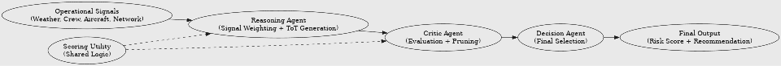

# Airline Disruption Forecasting & Decision Support Agent

## 1. Problem Overview

Airline disruptions are often caused by multiple interacting factors such as weather conditions, crew availability, aircraft delays, and network propagation effects. These disruptions can cascade across flights and impact overall airline operations.

Traditional monitoring systems often evaluate these signals in isolation, making it difficult to proactively identify the dominant disruption driver and take corrective actions.

This system addresses that challenge by providing an AI-powered decision-support agent that:

- Monitors multiple operational signals simultaneously
- Identifies the most critical disruption driver
- Recommends mitigation actions with explanation and confidence

### Intended Users

- Operations Control Center (OCC) analysts
- Crew schedulers
- Network planners
- Operational decision-makers

---

## 2. System Goal

The goal of the system is to:

- Forecast near-term disruption risk (0–6 hours)
- Identify the dominant disruption driver
- Recommend mitigation strategies
- Provide explainable outputs with confidence scores

### Success Criteria

- Accurate identification of disruption causes
- Actionable and realistic recommendations
- Clear and traceable reasoning

---

## 3. Architecture Overview

The system uses a multi-agent architecture combined with structured reasoning.

### Core Design Concepts

- Multi-agent design separates responsibilities across agents
- Tree-of-Thought (ToT) reasoning evaluates multiple solution paths
- Retrieval is represented conceptually through structured operational signals and external context inputs
- Guardrails enforce safe and reliable outputs
- Human oversight is used for high-risk or uncertain recommendations

### Key Architectural Flow

1. Input signals are collected (weather, crew, aircraft, and network)
2. Reasoning Agent generates candidate mitigation strategies
3. Critic Agent evaluates and prunes weaker options
4. Decision Agent selects the best action
5. Final output includes explanation and confidence

### Diagram



---

## 4. Key Components

### Signal Aggregator

Collects and normalizes disruption signals including:

- Weather conditions
- Crew availability
- Aircraft status
- Network propagation impacts

### Retrieval Agent

Adds external context such as advisories, alerts, or operational guidance.

In this prototype, retrieval is represented conceptually through structured operational signals rather than a production Retrieval-Augmented Generation (RAG) implementation.

### Reasoning Agent

Responsibilities:

- Signal weighting
- Dominant disruption driver identification
- Candidate mitigation generation
- Tree-of-Thought branch creation

### Critic Agent

Responsibilities:

- Evaluate mitigation candidates
- Apply scoring thresholds
- Prune weaker branches

### Decision Agent

Responsibilities:

- Select optimal mitigation path
- Produce final recommendation
- Generate confidence score and explanation

### Scoring Utility

Shared scoring functionality supports consistent evaluation across agents.

---

## 5. Workflow

1. Input ingestion
2. Signal weighting
3. Dominant driver identification
4. Tree-of-Thought branching
5. Candidate evaluation
6. Branch pruning
7. Final decision selection
8. Output generation

### Example Flow

```text
Signals
   ↓
Reasoning Agent
   ↓
Tree-of-Thought Branches
   ↓
Critic Agent
   ↓
Decision Agent
   ↓
Output
```

---

## 6. Tools & Tech Stack

### Core Technologies

- Python
- Jupyter Notebook
- JSON
- CSV

### Agent Frameworks (Conceptual Design)

- CrewAI
- LangChain
- MCP (Model Context Protocol)

### Reasoning Approaches

- Multi-Agent Architecture
- Tree-of-Thought Reasoning
- Structured Risk Scoring
- Decision Support Logic

### Data Sources

This prototype uses synthetic operational scenarios.

Future versions may integrate:

- Weather APIs
- Flight status APIs
- Operational alert feeds
- Airport advisories

---

## 7. How to Run / Use

### Single Scenario Demo

Open:

```text
notebooks/disruption_demo.ipynb
```

Run all notebook cells to evaluate a single disruption scenario.

### Multi-Scenario Demo (Recommended)

Open:

```text
notebooks/disruption_demo_multi_scenario.ipynb
```

This notebook loads multiple synthetic disruption scenarios and evaluates them using the same reasoning workflow.

### Scenario Data

The notebook reads:

```text
examples/disruption_scenarios.csv
```

### Repository Walkthrough

Review:

```text
agents/
utils/
examples/
```

to understand how the architecture components interact.

---

## 8. Example Input / Output

### Sample Input

See:

```text
examples/sample_input.json
```

Example:

```json
{
  "scenario_id": "ATL_DISRUPTION_001",
  "weather": "moderate storm at ATL",
  "crew": "limited availability",
  "aircraft": "minor delays",
  "network": "incoming delays from JFK"
}
```

### Sample Output

See:

```text
examples/sample_output.json
```

Example:

```json
{
  "risk_score": 0.78,
  "dominant_driver": "crew constraints",
  "recommendation": "Reassign reserve crew to high-priority flights",
  "confidence": 0.72
}
```

The output includes:

- Risk score
- Dominant disruption driver
- Recommended mitigation action
- Confidence score
- Explanation

---

## 9. Evaluation

The system is evaluated using:

- **Correctness** – Does the system identify the dominant disruption driver?
- **Groundedness** – Do recommendations align with input signals?
- **Calibration** – Does confidence reflect uncertainty?
- **Traceability** – Can reasoning be followed from input to output?
- **Recommendation Quality** – Does the action align to the disruption driver?

### Demo Results

The prototype successfully demonstrates:

- Dominant driver identification
- Explainable recommendations
- Structured reasoning flow
- Multi-agent decision logic

### Multi-Scenario Testing

The repository includes six synthetic disruption scenarios covering:

- Weather-driven disruptions
- Crew constraints
- Network propagation effects
- Aircraft availability issues

Files:

```text
notebooks/disruption_demo_multi_scenario.ipynb
examples/disruption_scenarios.csv
```

The notebook evaluates each scenario and produces:

- Risk score
- Dominant driver
- Recommendation
- Confidence score
- Match against expected scenario label

This demonstrates that the reasoning workflow can be applied consistently across multiple operational contexts rather than a single example.

---

## 10. Safety & Guardrails

The system includes multiple safety mechanisms.

### Input Guardrails

- Structured input validation
- Handling of incomplete scenarios
- Controlled input formats

### Reasoning Guardrails

- Consistent scoring methodology
- Constraint-based evaluation
- Candidate review prior to recommendation

### Output Guardrails

- Confidence scores included
- Explanations required
- Recommendations remain advisory only

### Human Intervention Triggers

Human review is recommended when:

- Confidence is below 0.60
- Signals conflict significantly
- Supporting evidence is weak
- High-impact operational decisions are involved

### Design Principle

The system is intentionally designed as a decision-support tool rather than a fully autonomous execution system.

---

## 11. Limitations & Future Work

### Current Limitations

- Uses synthetic disruption data
- Simplified scoring methodology
- Conceptual retrieval layer
- Simplified Tree-of-Thought implementation
- No live operational integrations

### Future Improvements

- Real-time weather and flight data APIs
- Full Retrieval-Augmented Generation (RAG)
- Advanced Tree-of-Thought search strategies
- Expanded testing dataset
- Operations control dashboard
- Historical calibration and learning

### Long-Term Vision

The long-term objective is to evolve the prototype into a scalable decision-support system capable of assisting airline operations teams with proactive disruption management while maintaining transparency, safety, and human oversight.

---

## Repository Contents

```text
airline-disruption-agent/
│
├── README.md
├── notebooks/
│   ├── disruption_demo.ipynb
│   └── disruption_demo_multi_scenario.ipynb
│
├── agents/
│   ├── reasoning_agent.py
│   ├── critic.py
│   └── decision_agent.py
│
├── utils/
│   └── scoring.py
│
├── examples/
│   ├── sample_input.json
│   ├── sample_output.json
│   └── disruption_scenarios.csv
│
└── diagrams/
    └── architecture.png
```

---

## GitHub Repository Purpose

This repository provides:

- Project documentation
- Architecture examples
- Agent implementations
- Demo notebooks
- Synthetic evaluation scenarios
- Example inputs and outputs

The goal is to allow reviewers to understand, evaluate, and reproduce the prototype workflow.

---

## Author Note

This project was developed as part of the Agentic AI Program Capstone.

All examples use synthetic or publicly shareable information only. No proprietary, confidential, private, or sensitive operational data is included.
